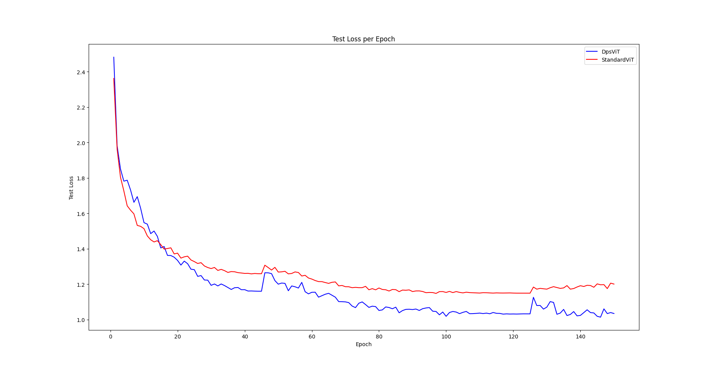

# Dynamic Patch Selection for Vision Transformers

## Overview

This repository presents an implementation of **Dynamic Patch Selection** for Vision Transformers (ViTs), introducing a novel mechanism that enables a ViT to dynamically focus on the most informative regions of an image. By allowing the model to select patches from varying locations for each input image and embedding these patches' spatial information directly into the positional encodings, we aim to enhance the model's learning capabilities. This repository also includes a comparison with a standard Vision Transformer, where both models are evaluated on the CIFAR-10 dataset under identical conditions.

## Key Idea: Dynamic Patch Selection

Traditional Vision Transformers divide an image into a fixed grid of patches, treating each patch equally and using fixed positional embeddings. While this approach simplifies the architecture, it may not fully leverage the spatial importance of different image regions, potentially leading to suboptimal performance.

Our **Dynamic Patch Selection** mechanism introduces a learnable cropping function that allows the model to focus on specific regions dynamically. This is achieved through the integration of a Spatial Transformer Network (STN) that generates translation parameters for patch selection.

## Visual Comparison: Standard vs Dynamic Patch Selection

To illustrate the difference between our Dynamic Patch Selection approach and the standard ViT patching, we've prepared a visual comparison using a sample image from the CIFAR-10 dataset.

- Left: The original input image of a bird from CIFAR-10.
- Middle: Patches selected by a standard ViT using a fixed grid.
- Right: Patches dynamically selected by the DpsViT, focusing on informative regions, sorted by their original positions just for sake of visualization.


As you can see, the Dynamic Patch Selection allows the model to focus on more relevant parts of the image, potentially leading to better feature extraction and classification performance.

### 1. Learnable Affine Transformations

- The STN outputs translation parameters for each patch, defining where to sample the patch from the input image.
- These parameters are passed through a hyperbolic tangent (`tanh`) activation function and then scaled to ensure that the sampled patches remain within the image boundaries and adjust based on the relative sizes of the patches and the image.
- Specifically, the scaling factor is calculated as:

  ```
  scaling_factor = 1 - (patch size / image size)
  ```

  The affine transformation matrix used for sampling patches is:

  ```
  A = [[s, 0, t_x],
       [0, s, t_y]]
  ```

  where:
  - `s` is the ratio of patch size to image size, i.e., `s = patch size / image size`
  - `t_x, t_y` are the translation parameters for the x and y axes, respectively, scaled appropriately.

### 2. Dynamic Patch Sampling

- The affine transformations are used to generate grids for sampling patches from the input image using `grid_sample`.
- Unlike the fixed grid approach, our method allows patches to be sampled from any location within the image. This variability acts as an inherent form of data augmentation and regularization.
- The selection of patches varies not only across different images but also across training iterations, enabling the model to explore various spatial configurations and focus on regions that are most relevant for the task at hand.

### 3. Embedding Positional Information

- Instead of using fixed positional embeddings, we directly embed the translation parameters generated by the STN.
- This approach ensures that the positional information is inherently aligned with the dynamically selected patches, maintaining spatial coherence.
- By integrating the positional embeddings with the learned translation parameters, the model effectively captures both the content and the spatial context of each patch.

### STN Architecture Flexibility

The architecture of the Spatial Transformer Network (STN) used to generate the translation parameters is highly flexible. For implementing the dynamic patch selection mechanism, the only requirement is that the STN ends with a multi-layer perceptron (MLP) that outputs a 2-dimensional vector corresponding to the translation parameters (`t_x` and `t_y`).

This flexibility allows you to design the STN according to your specific needs, whether you prefer a simple network for efficiency or a more complex one for capturing intricate spatial relationships. The key is that the STN effectively learns to output meaningful translation parameters that guide the dynamic patch selection process.

## Advantages of Dynamic Patch Selection

- **Adaptive Focus**: The model learns to prioritize informative regions within images, potentially leading to better feature representations and improved performance on downstream tasks.
- **Enhanced Regularization**: The dynamic nature of patch selection introduces variability during training, which can help prevent overfitting and improve the model's ability to generalize.
- **Efficient Positional Encoding**: Embedding the translation parameters simplifies the positional encoding process and aligns positional information with actual patch locations.

In summary, Dynamic Patch Selection empowers the Vision Transformer with the ability to adaptively focus on crucial image regions, leveraging spatial information more effectively and enhancing overall performance.

## Model Comparison

### Dynamic Patch Selection Vision Transformer

The Dynamic Patch Selection ViT incorporates the STN for flexible and adaptive patch selection, allowing the model to focus on varying regions of the image dynamically. By embedding the translation parameters as positional encodings, the model maintains spatial awareness aligned with the sampled patches. This design promotes better feature learning and potentially improves performance due to its ability to concentrate on informative areas within images.

### Standard Vision Transformer

The standard ViT serves as a baseline model, utilizing a fixed grid of patches and learned positional embeddings corresponding to predetermined locations. While effective, this approach treats all image regions equally and may not capitalize on the spatial importance of different areas within an image. The comparison aims to highlight the benefits of dynamic patch selection over this conventional method.

## Results

We evaluated both models on the CIFAR-10 dataset **without any pretraining**, ensuring a fair comparison by keeping all hyperparameters and model sizes identical.

### Performance Metrics

- **Dynamic Patch Selection ViT**:
  - **Highest Achieved Accuracy**: 90.99%
  - **Training Loss Convergence**: Initially converges slower due to the learning of effective patch selection, but surpasses the standard model in later epochs, achieving lower overall training loss.
- **Standard ViT**:
  - **Highest Achieved Accuracy**: 87.87%
  - **Training Loss Convergence**: Faster initial convergence but settles at a higher overall loss compared to the Dynamic Patch Selection ViT.

### Training Loss Comparison

The training loss curves for both models are depicted in the figure below.



The Dynamic Patch Selection ViT initially converges slower, likely due to the learning required for effective patch selection. However, it surpasses the standard ViT as training progresses, achieving a lower final loss. This indicates that the dynamic patch selection mechanism not only aids in focusing on relevant image regions but also enhances the overall optimization process.

### Accuracy Improvement

The Dynamic Patch Selection ViT outperformed the standard ViT by **3.12%** in terms of highest achieved accuracy on the test set. This improvement underscores the effectiveness of allowing the model to adaptively select patches, leading to better feature representation and generalization.

### Observations

- **Convergence Speed**: While the Dynamic Patch Selection model starts with slower convergence due to the complexity of learning adaptive patch selection, it eventually surpasses the standard model, indicating its long-term learning efficiency.
- **Generalization**: The inherent variability introduced by dynamic patch selection acts as a form of data augmentation, enhancing the model's generalization capabilities on unseen data.
- **Model Complexity**: Despite the additional computations introduced by the STN, the overall model complexity remains comparable to the standard ViT. The benefits in performance are achieved without a significant increase in computational overhead.

## Citations

- **Vision Transformer (ViT)**: Dosovitskiy, A., et al. (2020). *An Image is Worth 16x16 Words: Transformers for Image Recognition at Scale*. [arXiv:2010.11929](https://arxiv.org/abs/2010.11929).
- **Spatial Transformer Networks (STN)**: Jaderberg, M., et al. (2015). *Spatial Transformer Networks*. Advances in Neural Information Processing Systems (NeurIPS). [arXiv:1506.02025](https://arxiv.org/abs/1506.02025).

## How to Run

### Prerequisites

- Python 3.8+
- PyTorch 2.0+
- pyyaml
- torchvision
- tqdm

Install the required dependencies using:

```bash
pip install -r requirements.txt
```

### Training the Models

To train the Dynamic Patch Selection ViT on CIFAR-10:

```bash
python dps_vit_cifar10.py
```

To train the standard Vision Transformer on CIFAR-10:

```bash
python std_vit_cifar10.py
```

Both scripts will train the respective models and save the best-performing weights.

### Evaluation

The training scripts include evaluation functions that report test accuracy after each epoch. Models save their best weights during training:

- `dps_vit_cifar10.pth` for the Dynamic Patch Selection model.
- `std_vit_cifar10.pth` for the standard ViT.

## License

This project is licensed under the MIT License. See the [LICENSE](LICENSE) file for details.

## Acknowledgments

- **Alec Fessler** © 2024
- Special thanks to the PyTorch community and the open-source deep learning ecosystem for tools and inspiration.
