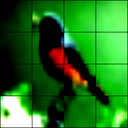
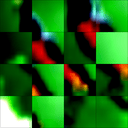

# Adaptive Patching for Vision Transformers

## Overview

This repository presents an implementation of Adaptive Patching for Vision Transformers (APViT), a novel mechanism that enhances the standard Vision Transformer architecture. APViT utilizes a Spatial Transformer Network (STN) to enable dynamic, content-aware patch selection, allowing the model to focus on the most informative regions of an image. The key innovation lies in applying the STN for adaptive patch sampling in the context of Vision Transformers. The module can be trained end-to-end as STNs enable differentiable spatial transformations. The repository includes the implementation of the Adaptive Patching module and an interpolation function for positional embeddings, which can be easily integrated into existing Vision Transformer implementations.

Importantly, APViT is designed as a drop-in enhancement for existing Vision Transformer architectures, requiring only two additions:
1. An Adaptive Patching layer for dynamic patch selection
2. An interpolation function for positional embeddings

These modifications seamlessly integrate with standard ViT implementations, maintaining their core structure while introducing adaptive capabilities.

The source code for both the `AdaptivePatching` module and the `InterpolatePosEmbeds` function can be found in the `modules` directory of this repository.

## Key Idea: Adaptive Patch Selection

APViT introduces a learnable patch selection mechanism that goes beyond the fixed grid approach of traditional Vision Transformers. This mechanism allows for:

1. Dynamic focus on informative regions: The model learns to prioritize areas of the image that are most relevant to the task at hand.
2. Flexible patch configuration independent of input image size: Patches can vary in position, receptive field, and spatial orientation for each image.
3. Potential for improved computational efficiency: By focusing on relevant areas, the model may achieve better performance with fewer computational resources.
4. Inherent regularization through stochastic patch selection: The dynamic nature of patch selection introduces a form of data augmentation, potentially improving generalization.

## Key Components of Adaptive Patching

### 1. Learnable Affine Transformations

- The Spatial Transformer Network generates transformation parameters for each patch.
- These parameters define where and how to sample patches from the input image.
- Transformations can include translation, scaling, and rotation, bounded to ensure valid sampling.
- Parameters are passed through activation functions and scaled to maintain patch integrity.

### 2. Dynamic Patch Sampling

- Affine transformations from the STN are used to sample patches from the input image.
- This approach allows for flexible patch locations, receptive fields, and orientations.
- Patch selection varies across different images and training iterations, enabling the model to explore various spatial configurations.

### 3. Interpolated Positional Embeddings

- Positional information is interpolated based on the translation parameters of the selected patches.
- This ensures spatial coherence with the dynamically selected patches.
- The interpolation process maintains the spatial context of each patch within the overall image.

## Advantages of Adaptive Patching

- **Content-Aware Focus**: The model learns to prioritize informative regions within images, potentially leading to better feature extraction and classification performance.
- **Flexible Scalability**: Offers flexibility in choosing the number and size of patches allowing for customization based on the specific task or computational constraints.
- **Potential for Efficiency**: Allows for selective sampling of the input, potentially reducing computational requirements without significant loss in accuracy.
- **Enhanced Regularization**: The stochastic nature of patch selection may improve generalization and reduce overfitting.
- **Easy Integration**: Can be readily incorporated into existing Vision Transformer architectures with minimal modifications.

## Model Architecture

The APViT extends the standard Vision Transformer architecture with two key modifications:

1. An Adaptive Patching module (based on STN) for dynamic patch selection: This module learns to sample a set of patches using predicted affine transformations.
2. An interpolation mechanism for positional embeddings: This ensures that positional information accurately reflects the locations of the dynamically selected patches.

These modifications are integrated seamlessly, maintaining the core structure of the Vision Transformer while enhancing its ability to focus on relevant image regions.

## Implementation Details

The core components of APViT can be found in the `modules` directory of this repository:

- `AdaptivePatching.py`: Contains the implementation of the Adaptive Patching module using Spatial Transformer Networks.
- `InterpolatePosEmbeds.py`: Provides the function for interpolating positional embeddings based on patch locations.

These modules can be easily integrated into existing Vision Transformer implementations to add adaptive patching capabilities.

## Visual Comparison

To illustrate the difference between Adaptive Patching and the standard ViT patching, a visual comparison using a sample image from the CIFAR-10 dataset is shown.

- Left: The original input image of a bird from CIFAR-10.
- Middle: Patches selected by a standard ViT using a fixed grid.
- Right: Patches adaptively selected by the APViT, focusing on informative regions.

Note: The current visualization only demonstrates translation-based patch selection. Future versions may include scaling and rotation.

## Ongoing Research

The development of Adaptive Patching for Vision Transformers (APViT) remains an active area of research with several promising directions:

1. **Diverse Computer Vision Tasks**: Exploration of APViT in a wider range of computer vision tasks, including:
   - Multiple object detection
   - Semantic segmentation
   These applications will help evaluate the versatility and effectiveness of adaptive patching across different visual understanding problems.

2. **Integration with Pretrained ViTs**: Investigation into incorporating APViT into existing pretrained Vision Transformers. This research aims to understand how adaptive patching can enhance the performance of models that have already learned robust feature representations.

3. **Advanced Transformation Types**: Building on the original Spatial Transformer Networks paper, future work could explore more complex transformations for patch selection, such as:
   - Projective transformations
   - 16-point thin plate spline transformations
   These could potentially allow for even more flexible and powerful patch selection mechanisms.

4. **Large-Scale Image Classification**: An interesting avenue for future research would be applying APViT to large-scale image classification tasks, such as ImageNet, using very large Vision Transformer models. This could provide valuable insights into the scalability and effectiveness of adaptive patching in more challenging and diverse datasets.

Collaborations and contributions from the research community are welcome to further explore these directions and unlock the full potential of adaptive patching in vision transformers.

## Citations

- **Vision Transformer (ViT)**: Dosovitskiy, A., et al. (2020). *An Image is Worth 16x16 Words: Transformers for Image Recognition at Scale*. [arXiv:2010.11929](https://arxiv.org/abs/2010.11929).
- **Spatial Transformer Networks (STN)**: Jaderberg, M., et al. (2015). *Spatial Transformer Networks*. Advances in Neural Information Processing Systems (NeurIPS). [arXiv:1506.02025](https://arxiv.org/abs/1506.02025).

## License

This project is licensed under the MIT License. See the [LICENSE](LICENSE) file for details.

## Acknowledgments

- **Alec Fessler** © 2024
- Special thanks to the PyTorch community and the open-source deep learning ecosystem for tools and inspiration.
